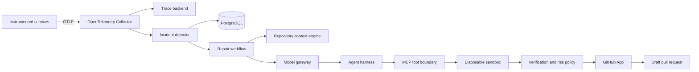
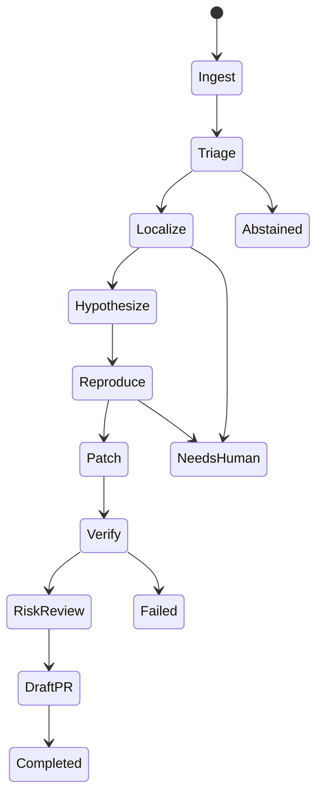

# System architecture

## Purpose

The platform converts production failure evidence into a verified, reviewable source-code change. It is designed to preserve the evidence chain from the original telemetry signal through the final draft pull request.

## System context

## Component boundaries

### Instrumented services

Application services emit traces, logs, and metrics with `service.name`, deployed Git SHA, image digest, deployment environment, exception details, and trace context. A trace must identify the code version that actually ran.

### Telemetry gateway

The OpenTelemetry Collector receives OTLP signals, applies resource enrichment, batching, redaction, and sampling, and exports data to both the observability backend and incident detection path.

### Incident detector

The detector validates candidate failures, retrieves the full trace, sanitizes sensitive content, calculates a stable fingerprint, groups duplicate occurrences, and starts a workflow only when policy permits investigation.

### Incident store

PostgreSQL stores normalized incident state, workflow transitions, evidence metadata, policy decisions, and audit events. Large immutable artifacts such as log bundles, test output, and patches move to object storage when their size justifies it.

### Repository context engine

The context engine checks out the deployed revision and builds a commit-addressed index from Tree-sitter symbols, exact stack frames, lexical search, language-service relationships, tests, ownership metadata, and Git history.

### Agent harness

The harness is a deterministic state machine around model calls. It controls budgets, tool availability, retries, evidence, and exit conditions. Model output never bypasses the policy layer.

### MCP tool boundary

MCP exposes narrow, schema-validated tools for telemetry reads, code reads, patch application, allowlisted tests, diff inspection, and GitHub handoff. Filesystem containment and command policy are enforced by executable code.

### Repair sandbox

Each repair receives a disposable checkout of the exact deployed revision. The process runs without production credentials, with resource limits and network denial by default. Only artifacts needed for review leave the sandbox.

### Verification and GitHub integration

Verification proves the failure before the patch where possible, runs focused and broader checks after the patch, scores risk, and opens a draft PR through a least-privilege GitHub App.

## Repair workflow

## Core records

### Incident

- Identity, fingerprint, service, environment, severity, and occurrence window
- Deployed Git SHA and image digest
- Trace references and sanitized exception summary
- Classification: code, configuration, dependency, infrastructure, or unknown

### Repair run

- Incident and repository snapshot IDs
- Workflow state and attempt number
- Model, prompt, policy, and tool-schema versions
- Budgets, evidence, hypotheses, tool calls, and outcomes

### Patch artifact

- Unified diff and changed-file inventory
- Reproduction and verification evidence
- Risk score and reviewer explanation
- Branch, commit, check-run, and pull-request references

## Reliability properties

- Incident fingerprinting makes trigger processing idempotent.
- Commit-addressed repository indexes prevent source-version drift.
- Durable workflow state allows interrupted work to resume safely.
- Tool calls carry idempotency keys when they can create external state.
- Draft PR creation is the initial terminal action; merge and deployment remain outside the MVP.
